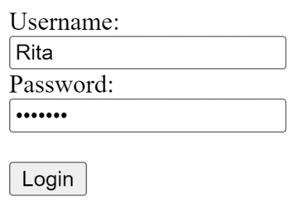
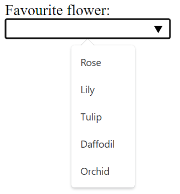
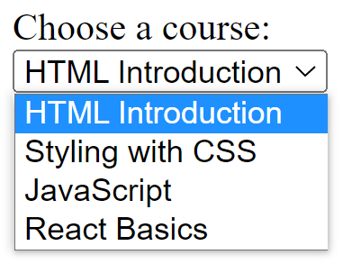

# Glossary: HTML form elements

## `<input>`

It is used to create interactive controls, for example, buttons and various types of text fields and so on, to accept input or data from the user. The key attribute of this element is `type`. Some common values for the `type` include: `button`, `checkbox`, `date`, `email`, `number`, `password`, `submit`, `text`, and `url`. These values dictate the appearance of the element. For example, this code:

Dịch: Nó được sử dụng để tạo các điều khiển tương tác, chẳng hạn như các nút và nhiều loại trường văn bản, v.v., để chấp nhận đầu vào hoặc dữ liệu từ người dùng. Thuộc tính chính của phần tử này là `type`. Một số giá trị phổ biến cho `type` bao gồm: `button`, `checkbox`, `date`, `email`, `number`, `password`, `submit`, `text` và `url`. Những giá trị này quyết định sự xuất hiện của phần tử. Ví dụ: mã này:

```html
<form action="my_action_page">
    <label for="uname">Username:</label>
    <br />
    <input type="text" id="uname" name="username" />
    <br />
    <label for="pwd">Password:</label>
    <br />
    <input type="password" id="pwd" name="pwd" />
    <br /><br />
    <input type="submit" value="Login" />
</form>
```

Results in the following output:



Note how the type `password` hides the user input.

## `<label>`

Defines a label for an element. It has an attribute "for", the value of which should be equal to the id attribute of the element it is associated with. Note how in the example above, the `<label>` is associated with the `<input>` using its id value.

Định nghĩa một nhãn cho một phần tử. Nó có thuộc tính "for", giá trị của thuộc tính này phải bằng thuộc tính id của phần tử mà nó được liên kết. Lưu ý cách trong ví dụ trên, `<label>` được liên kết với `<input>` bằng cách sử dụng giá trị id của nó.

## `<select>`

Defines a drop-down list of options presented to the user. It has a couple of attributes:

-   Form, the id of the form in which the drop-down appears

-   Name specifies the name of the control

-   Multiple Boolean attribute, when specified, indicates if a user can select multiple options out of the list

-   Required indicates if the user is required to select an option before submitting a form

-   Size mentions the number of visible options in a drop-down list

The options in a drop-down list are defined using the `<option>` element inside `<select>`. Note the example in the `<option>` description below.

Dịch:

Xác định danh sách thả xuống của các tùy chọn được trình bày cho người dùng. Nó có một vài thuộc tính:

-   Biểu mẫu, id của biểu mẫu mà trình đơn thả xuống xuất hiện

-   Tên chỉ định tên của điều khiển

-   Thuộc tính Multiple Boolean, khi được chỉ định, cho biết liệu người dùng có thể chọn nhiều tùy chọn trong danh sách hay không

-   Bắt buộc cho biết nếu người dùng được yêu cầu chọn một tùy chọn trước khi gửi biểu mẫu

-   Kích thước đề cập đến số lượng tùy chọn hiển thị trong danh sách thả xuống

Các tùy chọn trong danh sách thả xuống được xác định bằng phần tử `<option>` bên trong `<select>`. Lưu ý ví dụ trong mô tả `<option>` bên dưới.

## `<textarea>`

Defines a multi-line input field, typically to allow the user to input longer textual data. The common attributes for this element include:

-   `cols` defines the width of the text area, the default value is 20

-   `form` the form element the text area is associated with

-   `maxlength` when specified, limits the maximum number of characters that can be entered in the text area

-   `minlength` the minimum number of characters that the user should enter

-   `readonly` once set, the user cannot modify the contents

-   `rows` defines the number of visible text lines for the text area

The following line of code defines a text area of 10 visible lines and nearly 30 characters wide where the user can input a maximum of 200 characters:

Dịch:

Xác định trường nhập nhiều dòng, thường để cho phép người dùng nhập dữ liệu văn bản dài hơn. Các thuộc tính phổ biến cho phần tử này bao gồm:

-   `cols` xác định độ rộng của vùng văn bản, giá trị mặc định là 20

-   `form` phần tử biểu mẫu mà vùng văn bản được liên kết với

-   `maxlength` khi được chỉ định, giới hạn số ký tự tối đa có thể nhập vào vùng văn bản

-   `minlength` số ký tự tối thiểu mà người dùng nên nhập

-   `readonly` sau khi được đặt, người dùng không thể sửa đổi nội dung

-   `rows` xác định số dòng văn bản hiển thị cho vùng văn bản

Dòng mã sau xác định vùng văn bản gồm 10 dòng có thể nhìn thấy và rộng gần 30 ký tự mà người dùng có thể nhập tối đa 200 ký tự:

```html
<textarea name="response" rows="10" cols="30" maxlength="”200”"> </textarea>
```

## `<button>`

Defines a clickable button. The `onclick` attribute defines the behavior when the button is clicked by the user. For example, in the code below, an alert message is shown to the user.

Xác định một nút có thể nhấp. Thuộc tính `onclick` xác định hành vi khi người dùng nhấp vào nút. Ví dụ: trong mã bên dưới, một thông báo cảnh báo được hiển thị cho người dùng.

```html
<button type="button" onclick="alert('You just clicked!')">Click Me!</button>
```

## `<fieldset>`

Used to group related input elements in a form. For instance, elements related to the user’s personal information and educational qualification can be grouped separately in two field sets.

Được sử dụng để nhóm các yếu tố đầu vào có liên quan trong một biểu mẫu. Chẳng hạn, các yếu tố liên quan đến thông tin cá nhân và trình độ học vấn của người dùng có thể được nhóm riêng trong hai bộ trường.

## `<legend>`

Defines a caption for the `<fieldset>` element. For example:

```html
<fieldset>
    <legend>Personal Info</legend>
    <label for="fname">First name:</label><br />
    <input type="text" id="fname" name="fname" value="John" /><br />
    <label for="lname">Last name:</label><br />
    <input type="text" id="lname" name="lname" value="Doe" /><br />
</fieldset>

<fieldset>
    <legend>Qualificaiton</legend>
    <label for="pdegree">Primary degree:</label><br />
    <input type="text" id="pdegree" name="degree" value="Masters" /><br />
    <label for="fos">Last name:</label><br />
    <input type="text" id="fos" name="field" value="Psychology" /><br />
</fieldset>
```

## `<datalist>`

Specifies a list of pre-defined options for an input element. It differs from `<select>` since the user can still provide textual or numeric input other than the listed options.

Chỉ định danh sách các tùy chọn được xác định trước cho một phần tử đầu vào. Nó khác với `<select>` vì người dùng vẫn có thể cung cấp đầu vào dạng văn bản hoặc số ngoài các tùy chọn được liệt kê.

```html
<form action="/my_action_page">
    <label for="flowers">Favourite flower:</label><br />
    <input list="flowers" name="flowers" />
    <datalist id="flowers">
        <option value="Rose"></option>
        <option value="Lily"></option>
        <option value="Tulip"></option>
        <option value="Daffodil"></option>
        <option value="Orchid"></option>
    </datalist>

    ...
</form>
```



## `<output>`

Represents the result of a calculation (typically the output of a script) or the outcome of the user action.

Biểu thị kết quả của phép tính (thường là đầu ra của tập lệnh) hoặc kết quả của hành động người dùng.

## `<option>`

Defines an option for the drop-down list. The following code example demonstrates how a simple list can be defined, with the rendered view below the code block.

Xác định một tùy chọn cho danh sách thả xuống. Ví dụ mã sau minh họa cách xác định danh sách đơn giản, với chế độ xem được hiển thị bên dưới khối mã.

```html
<label for="course">Choose a course:</label><br />
<select id="course" name="courselist">
    <option value="html">HTML Introduction</option>
    <option value="css">Styling with CSS</option>
    <option value="js">JavaScript</option>
    <option value="react">React Basics</option>
</select>
```



By default, the first item in the drop-down list is selected. To define a pre-selected option, add the selected attribute to the option.

Theo mặc định, mục đầu tiên trong danh sách thả xuống được chọn. Để xác định tùy chọn được chọn trước, hãy thêm thuộc tính đã chọn vào tùy chọn.

## `<optgroup>`

Defines a group of related options in a drop-down list. Its attribute label names the group.

Xác định một nhóm các tùy chọn có liên quan trong danh sách thả xuống. Nhãn thuộc tính của nó đặt tên cho nhóm.
