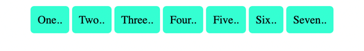
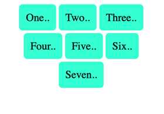
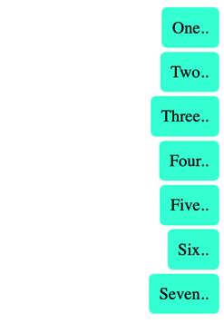
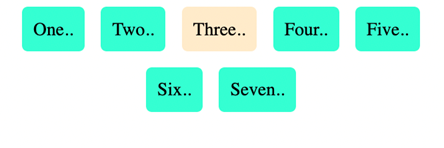

# Understanding flexbox

Much like the div and box container that you can create using HTML, flexbox is a type of container. Flexbox can overcome the limitations caused by containers such as block and inline because it does a better job of scaling over larger web pages and also provides more dynamic control of the containers. This is because it can grow, shrink and align the items inside it which give better control to the programmer over the contents and styling of the items inside the container.

Dịch: Giống như vùng chứa div và hộp mà bạn có thể tạo bằng HTML, flexbox là một loại vùng chứa. Flexbox có thể khắc phục những hạn chế do các vùng chứa như khối và nội tuyến gây ra vì nó thực hiện tốt hơn việc mở rộng quy mô trên các trang web lớn hơn và cũng cung cấp khả năng kiểm soát động hơn đối với các vùng chứa. Điều này là do nó có thể phát triển, thu nhỏ và căn chỉnh các mục bên trong nó, giúp lập trình viên kiểm soát tốt hơn nội dung và kiểu dáng của các mục bên trong vùng chứa.

Flexbox is single-dimensional, which means you can align it either along a row or a column and it is set to row alignment by default. There are two axes, the main and cross-axis, much like the x and y-axis used in coordinate geometry. When aligned along the row, the horizontal axis is called the main axis and the vertical axis is called the cross axis. For the items present inside the flexbox container, the placement starts from the top-left corner moving along the main or horizontal axis. When the row is filled, the items continue to the next row. Note that with the help of a property called flex-direction, you can instead flip the main axis to run vertically and the cross axis will then be horizontal. In such a case, the items will start from top left and move down along the vertical main axis. The properties you choose will help better control alignment, spacing, direction and eventually styling of the container and items present inside it.

Dịch: Flexbox là một chiều, có nghĩa là bạn có thể căn chỉnh nó dọc theo một hàng hoặc một cột và nó được đặt thành căn chỉnh theo hàng theo mặc định. Có hai trục, trục chính và trục chéo, giống như trục x và trục y được sử dụng trong hình học tọa độ. Khi dóng dọc theo hàng thì trục ngang gọi là trục chính và trục dọc gọi là trục chéo. Đối với các mục có bên trong hộp chứa flexbox, vị trí bắt đầu từ góc trên cùng bên trái di chuyển dọc theo trục chính hoặc trục ngang. Khi hàng được lấp đầy, các mục tiếp tục đến hàng tiếp theo. Lưu ý rằng với sự trợ giúp của một thuộc tính được gọi là flex-direction, thay vào đó, bạn có thể lật trục chính để chạy theo chiều dọc và trục chéo sau đó sẽ nằm ngang. Trong trường hợp này, các mục sẽ bắt đầu từ trên cùng bên trái và di chuyển xuống dọc theo trục chính dọc. Các thuộc tính bạn chọn sẽ giúp kiểm soát tốt hơn căn chỉnh, khoảng cách, hướng và cuối cùng là kiểu dáng của vùng chứa và các mục có trong đó.


Image source: https://css-tricks.com/snippets/css/a-guide-to-flexbox/#aa-basics-and-terminology

Let’s now examine some of the important properties that will allow you to configure a flexbox.

Bây giờ chúng ta hãy kiểm tra một số thuộc tính quan trọng sẽ cho phép bạn định cấu hình một flexbox.

## Flexbox properties

Original HTML code:

```html
<body>
    <div class="flex-container">
        <div class="box box1">One..</div>
        <div class="box box2">Two..</div>
        <div class="box box3">Three..</div>
        <div class="box box4">Four..</div>
        <div class="box box5">Five..</div>
        <div class="box box6">Six..</div>
        <div class="box box7">Seven..</div>
    </div>
</body>
```

Original CSS file:

```css
.box {
    background-color: aquamarine;
    border-radius: 5px;
    margin: 2px;
    padding: 10px;
}
```

Output:


There are seven div containers inside the HTML file.

Có bảy vùng chứa div bên trong tệp HTML.

The corresponding CSS file contains rules for all seven div tags that have the box class. Note how two class names are given for each of the tags, one that is common among all classes and another independent of it. The style is applied to all the containers.

Tệp CSS tương ứng chứa các quy tắc cho tất cả bảy thẻ div có lớp hộp. Lưu ý cách hai tên lớp được cung cấp cho mỗi thẻ, một tên phổ biến giữa tất cả các lớp và một tên khác độc lập với nó. Kiểu được áp dụng cho tất cả các vùng chứa.

Now let’s add properties to the flex container by converting it into flex.

Bây giờ, hãy thêm các thuộc tính vào bộ chứa flex bằng cách chuyển đổi nó thành flex.

**display: flex;**

```css
.flex-container {
    display: flex;
}
```

The output is now seven flex containers that run from left to right starting in the top left corner.

Đầu ra bây giờ là bảy hộp chứa linh hoạt chạy từ trái sang phải bắt đầu ở góc trên cùng bên trái.


## Alignment properties

Let’s examine a few alignment properties inside the flex. There are four main properties used to align a flex container and items present inside it:

Hãy kiểm tra một vài thuộc tính căn chỉnh bên trong flex. Có bốn thuộc tính chính được sử dụng để căn chỉnh một hộp chứa linh hoạt và các mục có bên trong nó:

-   `justify-content`. For item alignment on main axis.

-   `justify-content`. Để căn chỉnh mục trên trục chính.

-   `align-items`. For item alignment on cross axis.

-   `align-items`. Đối với căn chỉnh mục trên trục chéo.

-   `align-self`. For unique flex items on cross axis.

-   `align-self`. Đối với các mục flex duy nhất trên trục chéo.

-   `align-content`. Used for packing flex lines and control over space.

-   `align-content`. Được sử dụng để đóng gói các dòng flex và kiểm soát

Of these, justify-content and align-items are frequently used for the respective two axes.

Dịch: Trong số này, justify-content và align-items thường được sử dụng cho hai trục tương ứng.

Let’s first examine the use of justify-content which has a value of ‘left’ by default.
Dịch: Trước tiên, hãy kiểm tra việc sử dụng nội dung justify có giá trị 'left' theo mặc định.

Dịch:

**justify-content**

CSS:

```css
.flex-container {
    display: flex;
    justify-content: center;
}
```

Output:



**flex-wrap:**

The default for this property is ‘nowrap’ which means the items will span the entire width of the axis.

Dịch: Giá trị mặc định cho thuộc tính này là 'nowrap', có nghĩa là các mục sẽ trải rộng trên toàn bộ chiều rộng của trục.

```css
.flex-container {
    display: flex;
    justify-content: center;
    flex-wrap: wrap;
}
```

Output:



The items will now be wrapped to the size of the available viewport.

Dịch: Bây giờ các mục sẽ được bao bọc theo kích thước của khung nhìn có sẵn.

**flex-direction:**

This property is used to set the main axis, which is a ‘row’ by default. It basically means you are changing your ‘main’ axis from horizontal rows to vertical columns.

Dịch: Thuộc tính này được sử dụng để đặt trục chính, theo mặc định là một 'hàng'. Về cơ bản, điều đó có nghĩa là bạn đang thay đổi trục 'chính' của mình từ hàng ngang sang cột dọc.

CSS Code:

```css
.flex-container {
    display: flex;
    justify-content: center;
    flex-direction: column;
    flex-wrap: wrap;
}
```

Output:


The output looks like the original output; however, it is now actually a flex.

Dịch: Đầu ra trông giống như đầu ra ban đầu; tuy nhiên, bây giờ nó thực sự là một flex.

Now let’s align the items again and examine a couple of the other properties mentioned earlier.

Dịch: Bây giờ, hãy sắp xếp lại các mục và kiểm tra một số thuộc tính khác đã đề cập trước đó.

**align-items:**

The alignment on the cross-axis is done with the help of this property. Let’s change the value for it to ‘flex-end’.

Dịch: Căn chỉnh trên trục chéo được thực hiện với sự trợ giúp của thuộc tính này. Hãy thay đổi giá trị cho nó thành 'flex-end'.

CSS Code:

```css
.flex-container {
    display: flex;
    justify-content: center;
    flex-direction: column;
    flex-wrap: wrap;
    align-items: flex-end;
}
```

Output:



The term ‘end’ refers to the right side of the page as the left side is seen as the beginning.

Dịch: Thuật ngữ 'kết thúc' đề cập đến phía bên phải của trang vì phía bên trái được coi là phần đầu.

**align-self:**

This property can be used on individual items inside the flex.

Dịch: Thuộc tính này có thể được sử dụng trên các mục riêng lẻ bên trong flex.

```css
.flex-container {
    display: flex;
    justify-content: center;
    flex-direction: column;
    flex-wrap: wrap;
    align-items: flex-end;
}
.box3 {
    background-color: blanchedalmond;
    align-self: center;
}
```

Output:


Here the color and alignment of the third box have been changed and it overrides the properties set using align-items.

Dịch: Ở đây, màu sắc và căn chỉnh của hộp thứ ba đã được thay đổi và nó sẽ ghi đè các thuộc tính được đặt bằng cách sử dụng các mục căn chỉnh.

**gap:**

gap property can be used to create space between the items along the main axis. You can also individually configure the gaps in rows and columns using row-gap and column-gap properties.

Dịch: thuộc tính khoảng cách có thể được sử dụng để tạo khoảng cách giữa các mục dọc theo trục chính. Bạn cũng có thể định cấu hình riêng lẻ các khoảng trống trong hàng và cột bằng cách sử dụng thuộc tính khoảng cách hàng và khoảng cách cột.

CSS Code:

```css
.flex-container {
    display: flex;
    justify-content: center;
    flex-direction: column;
    flex-wrap: wrap;
    align-items: flex-end;
    gap: 10px;
}
.box3 {
    background-color: blanchedalmond;
    align-self: center;
}
```

Output:


There is a clear change in spacing between the items.

Dịch: Có một sự thay đổi rõ ràng về khoảng cách giữa các mục.

The final set of properties are flex-grow, flex-shrink and flex-basis. Together these determine how the flex takes up space, grows or shrinks according to the space available.

Dịch: Tập hợp các thuộc tính cuối cùng là flex-grow, flex-shrink và flex-basis. Những điều này cùng nhau xác định cách flex chiếm không gian, phát triển hoặc thu nhỏ theo không gian có sẵn.

These are the sub-properties of a property called flex. Together all three properties can also be given values with the help of something called the shorthand notation in CSS. Shorthand notation helps you make your code compact and also easy to write and follow. The values left empty in shorthand notation are given their default values.

Dịch: Đây là các thuộc tính phụ của một thuộc tính được gọi là flex. Đồng thời, cả ba thuộc tính cũng có thể được cung cấp các giá trị với sự trợ giúp của một thứ gọi là ký hiệu tốc ký trong CSS. Ký hiệu tốc ký giúp bạn làm cho mã của mình nhỏ gọn và cũng dễ viết và theo dõi. Các giá trị để trống trong ký hiệu tốc ký được cung cấp các giá trị mặc định của chúng.

For example:

```css
.flex-container {
    flex: 0 1 auto;
}
```

Here for the flex-container class, there is a set rule for the flex property. The values correspond to the three properties, namely the flex-grow set to 0, flex-shrink to 1 and flex-basis to auto. The flex-basis sets the initial size of the container. and together they define the rigidity or flexibility and dynamism you want to add to the flexbox.

Dịch: Ở đây đối với lớp flex-container, có một quy tắc được thiết lập cho thuộc tính flex. Các giá trị tương ứng với ba thuộc tính, cụ thể là flex-grow được đặt thành 0, flex-shrink thành 1 và flex-basis thành tự động. Cơ sở flex đặt kích thước ban đầu của vùng chứa. và chúng cùng nhau xác định tính cứng nhắc hoặc tính linh hoạt và năng động mà bạn muốn thêm vào flexbox.

To demonstrate the effect of this, the code has to be modified slightly by removing the flex-direction value set to ‘column’. This will change it to default ‘row’ and the output will again be centrally aligned and horizontal best-distributed between two rows.

Dịch: Để chứng minh tác dụng của điều này, mã phải được sửa đổi một chút bằng cách xóa giá trị hướng uốn được đặt thành 'cột'. Điều này sẽ thay đổi nó thành 'hàng' mặc định và đầu ra sẽ lại được căn giữa và phân phối tốt nhất theo chiều ngang giữa hai hàng.

Output:



The rest of the remaining code is unchanged. However, the output will change if the code is modified with the addition of the flex property inside the flex item box3 class.

Dịch: Phần còn lại của mã còn lại là không thay đổi. Tuy nhiên, đầu ra sẽ thay đổi nếu mã được sửa đổi với việc bổ sung thuộc tính flex bên trong lớp flex item box3.

CSS Code:

```css
.box3 {
    background-color: blanchedalmond;
    align-self: center;
    flex: 1 1 auto;
}
```

Output:


The third box now takes up the entire free space available because flex-growth’s value has been set to 1. So if we have `flex-grow` set to 1, the children will all set to equal size. And if one of the children has a value of 1.5, that child would take up more space as compared to the others.

Dịch: Hộp thứ ba hiện chiếm toàn bộ không gian trống có sẵn vì giá trị của flex-grow đã được đặt thành 1. Vì vậy, nếu chúng ta đặt `flex-grow` thành 1, tất cả các phần tử con sẽ được đặt thành kích thước bằng nhau. Và nếu một trong những đứa trẻ có giá trị là 1,5, thì đứa trẻ đó sẽ chiếm nhiều không gian hơn so với những đứa trẻ khác.

It’s important to understand how the changes in the main and cross axis affect the way you imagine and manipulate the flexbox. Once you’ve had more practice you’ll be more comfortable with the use of these properties, and it will become easier to use flexboxes and understand the flow and alignment of items inside the flexbox.

Dịch: Điều quan trọng là phải hiểu những thay đổi trong trục chính và trục chéo ảnh hưởng như thế nào đến cách bạn hình dung và thao tác với flexbox. Khi bạn đã thực hành nhiều hơn, bạn sẽ cảm thấy thoải mái hơn với việc sử dụng các thuộc tính này và việc sử dụng hộp linh hoạt sẽ trở nên dễ dàng hơn cũng như hiểu được luồng và căn chỉnh của các mục bên trong hộp linh hoạt.
